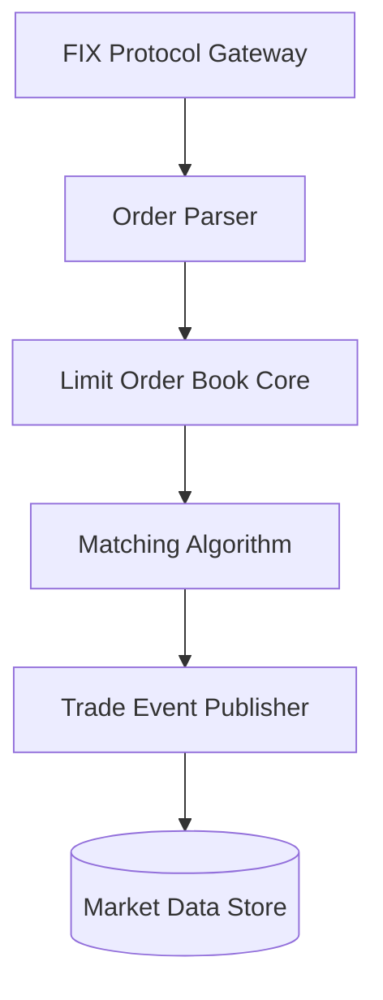

<div align="center">
  <h1>Ultra-Low Latency Matching Engine</h1>
  <p><b>A high-frequency trading (HFT) limit order book implemented in modern C++20.</b></p>
  
  <p>
    
    
  </p>
</div>

---

## 📖 Overview

An ultra-low latency matching engine designed for High-Frequency Trading (HFT) environments. This engine implements a robust Limit Order Book (LOB) prioritizing Price-Time matching algorithms, engineered to process millions of orders per second.

## ✨ Features

- **Microsecond Latency:** Designed from the ground up for minimal allocation and cache-friendly data structures.
- **Modern C++20:** Utilizing standard layout types, constexpr optimization, and custom memory pools.
- **Price-Time Priority:** Strict FIFO matching algorithm for bids and asks.

## 🏗️ Architecture



## 🚀 Building the Engine

```bash
mkdir build
cd build
cmake -DCMAKE_BUILD_TYPE=Release ..
make
./hft_engine
```
